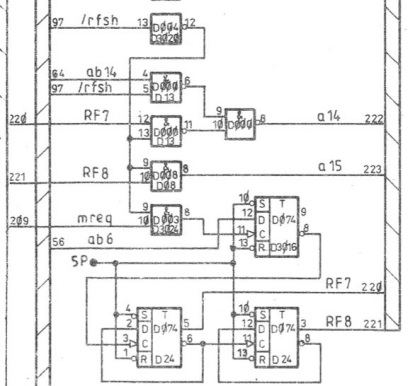
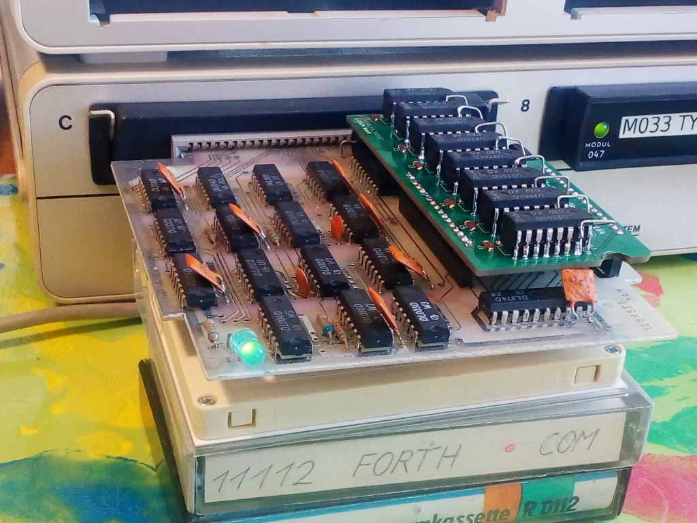
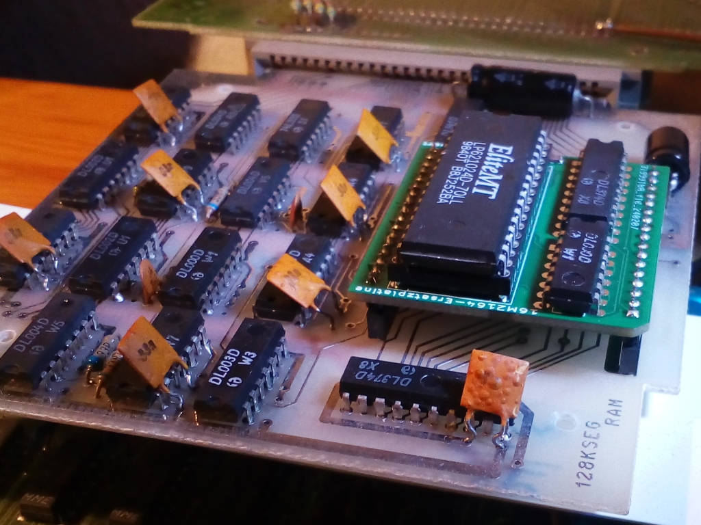

# Ersatz für Hybridschaltkreis 16M2164 (1 MBit dynamischer RAM)

Der Hybridschaltkreis 16M2164 von KWH (Keramische Werke Hermsdorf) scheint nur in sehr geringen Stückzahlen hergestellt worden zu sein. Er enthält 16 mal das Die (ein Stück vom Halbleiterwafer) des Schaltkreises U2164 sowie einige Stützkondensatoren auf einem Keramiksubstrat.  
Der U2164 ist ein dynamischer RAM mit 64kBit.  
In Summe enthält der 16M2164 ein MegaBit bzw. 128 kByte Speicher.

Zum Einzigen - mir bekannten Einsatz - kommt der Schaltkreis 16M2164 im Speichermodul M036 für den KC85 aus Mühlhausen [^1].  
Um die unbestückten Leiterplatte, die für dieses Modul im Umlauf sind, nutzen zu können, benötigt man einen Ersatz für den 16M2164.

Von U. Zander stammt die urspüngliche Idee einer Schaltkreisersatzplatine, die nur mit vier dRAM-Schaltkreisen auskommt [^2].
Diese Lösung funktioniert leider nicht perfekt.

> [!Note]
> ### dynamischer Speicher
> Bei dynamischen Speichern wird die Information als Ladung in Kondensatoren abgebildet. Durch Leckströme verliert sich diese Ladung mit der Zeit und muß daher regelmäßig aufgefrischt werden (Refresh). Dies geschiet u.a. beim Aktivieren des /RAS-Signals. Der Hersteller gibt dabei an, in welchem Zeitraum jede ROW-Adresse einmal aktiviert werden muß. Normalerweise wird die angelegte ROW-Adresse vom Speichercontroller entsprechend hochgezählt. Bei einem geschickt adressierten Bildwiederholspeicher könnte man auf den Refresh verzichten, da dort durch regelmäßige Lesezugriffe die Information beim Lesen aufgefrischt wird.

In der folgenden Tabelle sind die Refreshzyklen eingier dRAM-Hersteller aufgeführt:

Hersteller  | Speicher-IC | Speichergröße | Refreshzyklen | Refreshzeit | Gehäuse
----------  | ----------- | ------------: | ------------: | ----------: | -------
&nbsp;      | &nbsp;      | _x1 Bit dRAMs_ 
Mostek      | MK4096      |   4k x 1      |   64          |  2 ms       | DIP16
Mostek      | MK4116      |  16k x 1      |  128          |  2 ms       | DIP16
NEC         | µPD4164     |  64k x 1      |  128          |  2 ms       | DIP16
Mostek      | MK4564      |  64k x 1      |  128          |  2 ms       | DIP16, PLCC18
Mostek      | MK4164      |  64k x 1      |  256          |  4 ms       | DIP16
Siemens     | HYB4164     |  64k x 1      |  256          |  4 ms       | DIP16
Mostek      | MK41256     | 256k x 1      |  256          |  4 ms       | DIP16, PLCC18
Siemens     | HYB51100    |   1M x 1      |  512          |  8 ms       | SOJ26
&nbsp;      | &nbsp;      | _x4 Bit dRAMs_ 
TI          | TMS4416     |  16k x 4      |  256          |  4 ms       | DIP18, PLCC18
TI          | SMJ4464     |  64k x 4      |  256          |  4 ms       | DIP18, PLCC18
NEC         | µPD41464    |  64k x 4      |  256          |  4 ms       | DIP18, PLCC18
TI          | SMJ4464     |  64k x 4      |  256          |  4 ms       | DIP18, PLCC18
Mitsubishi  | M5M4464A    |  64k x 4      |  256          |  4 ms       | DIP18, PLCC18, ZIP20
Samsung     | KM41464A    |  64k x 4      |  256          |  4 ms       | DIP18, PLCC18, ZIP20
Siemens     | HYB514256   | 256k x 4      |  512          |  8 ms       | DIP20, SOJ26/20
NEC         | µPD424400   |   1M x 4      | 1024          | 16 ms       | TSOP26, SOJ26/20

Die verwendeten Speicher-IC der Größe 64k x 4 Bit benötigen alle 256 Refreshzyklen. Damit muß der Zähler für den Refresh mindestens acht Bit breit sein.
Die U880/Z80-CPU enthält nur einen 7 Bit-Refreshzähler, der für die Bausteine mit 64 oder 128 Refreshzyklen ausreichend ist.
Die obere Hälfte des Speichers erhält keinen definierten Refresh und verliert mit der Zeit ihren Inhalt.

Im Folgenden sind drei Alternativen aufgezeigt:

## Variante R: Refresh
Man könnte den Refreshzähler erweitern.  
Ein Schaltung dafür findet sich z.B. in [^3].

Auch im Grundgerät D001 (KC85/4) werden aus den Signalen /rfsh, mreq und ab6 die Signale RF7 und RF8 gebildet, die den Refreshzähler des Z80 auf 9 Bit erweitern:

  

Der erweiterte Refreshzähler steht leider nur den interne RAM-Bausteinen auf der Hauptplatine zur Verfügung.

Am Modul 16M2164 steht weder der erweiterte Refreshzähler noch das eigentliche Refresh-Signal zur Verfügung.  
Zumindest letzteres müsste auf separatem Weg  zugeführt werden.  
Daher wurde diese Lösung nicht weiter verfolgt.

## Variante D: dynamischer RAM
Im Robotrontechnik-Forum ist ein Bild vom Innenaufbau des 16M2164 verlinkt [^4]. Mit etwas Geschick lassen sich die 16 Stück U2164 auf einer Aufsteckplatine plazieren und so die Schaltung des 16M2164 1:1 nachbilden.
Die erste Hälfte der Schaltkreise sitzt direkt auf der Adapterplatine. Die zweite Hälfte wird huckepack auf die bereits eingelöteten Schaltkreise gelötet und bis auf das /CAS-Signal parallel geschaltet.
Die zweite Hälfte wird mit dem /CAS1-Signal aktiviert.

Der große Nachteil dieser Lösung: sie benötigt zuviel Platz und passt nicht mehr in ein Modulgehäuse.
Das M036 läßt sich so regulär nur offen an einem Adapter M007 betreiben.

## Variante S: statischer RAM
Warum ersetzen wir nicht die dRAM-Schaltkreise durch einen einzelnen SRAM der Größe 128kx8 Bit?
Ein SRAM benötigt die Signale /CS, /WE und /OE sowie Daten und Adressen.
Am Bestückungsplatz für das 16M2164 stehen die Signale /RAS, /CAS0 (unter Hälfte), /CAS1 (obere Hälfte) und /WE zur Verfügung. Die Adressenleitungen sind multiplext.

Die Adressen müssen wieder demultiplext werden und für die Steuersignale ist eine Signalanpassung nötig.
Ein Latch, was mit dem invertierten /RAS-Signal angesteuert wird, speichert die eine Hälfte der Adressinformation. Die andere Hälfte der Adresse wird direkt an den SRAM durchgereicht. Aus /CAS0 und /CAS1 wird das /CS-Signal gebildet. Aus dem Signal /WE wird noch das Signal /OE abgeleitet.

Da es ein RAM ist, dürfen Datenleitungen problemlos miteinander vertauscht werden. Ebenso kann man Adressleitungen tauschen, solange keine Sonderfunktionen realisiert sind.
Damit wird das Routing auf der zweilagigen Platine erleichtert.

Im Bild ist die Lösung zu sehen, die von der Grundfläche dem Original 16M2164 entspricht.

Mit flachen Präzisions-Stiftleisten läßt sich die Ersatzplatine so im Modulgehäuse unterbringen.

# Test im M036 #
Für einen Speichertest im KC85/4 bzw. KC85/5 bietet sich das Programm RAMTEST3 an.
Um gezielt nur das Speichermodul M036 zu testen kann man mit `TESTM` den Modulschacht mit angeben, z.B. `TESTM 0C`.
Anschließend werden die acht Segmente des M036 durchgetestet.

![M036 Speichertest]{Bilder/M036_Speichertest.jpg}

# Nutzung des Modul M036 #

## Typestar + RAMDOS ##

## RAM-Disk für MicroDOS (D004) ##

Beim Start von MicroDOS werden vorhande RAM-Module als RAM-Disk (Laufwerk A:) initialisiert.
Das funktioniert auch mit dem M036.

![M036 als RAM-Disk]{Bilder/M036_MicroDOS.png =20%x}

### Referenzen und Links
[^1]: Modul M036, Beschreibung, Bilder und Handbuch: [Modulbeschreibung auf mpm-kc85.de](http://www.mpm-kc85.de/html/m036_segram128k.htm)

[^2]: Schaltkreisersatzplatine 16M2164 [https://www.sax.de/~zander/ --> Hobby --> KC85 --> Hardware --> 128K-Segmented-RAM-Modul (M036)](https://www.sax.de/~zander/)

[^3]: c't 1984, Heft 9, M. Hungershausen, 8-Bit-Refresh für Z80

[^4]: Bild vom Innenleben des 16M2164 [Forum robotrontechnik.de](https://www.robotrontechnik.de/html/forum/thwb/showtopic.php?threadid=2115)

Innenleben des U2164
https://www.richis-lab.de/RAM02.htm
