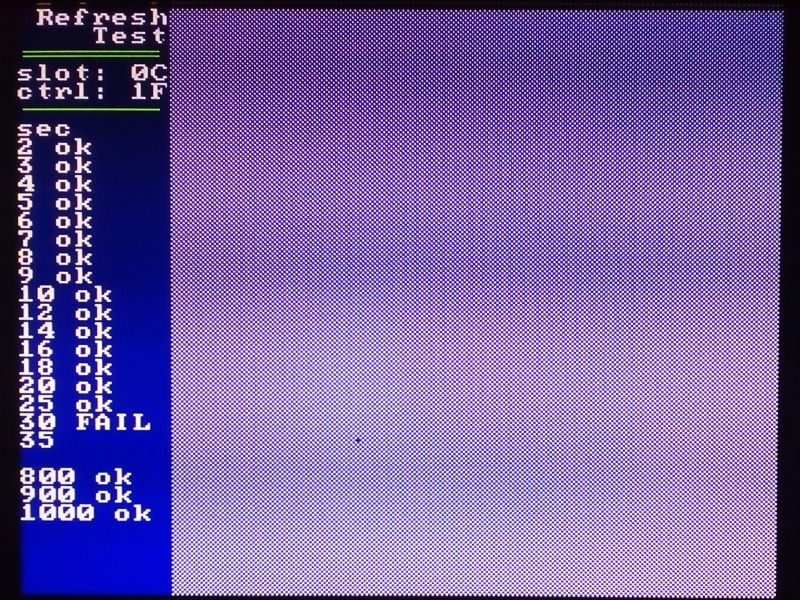
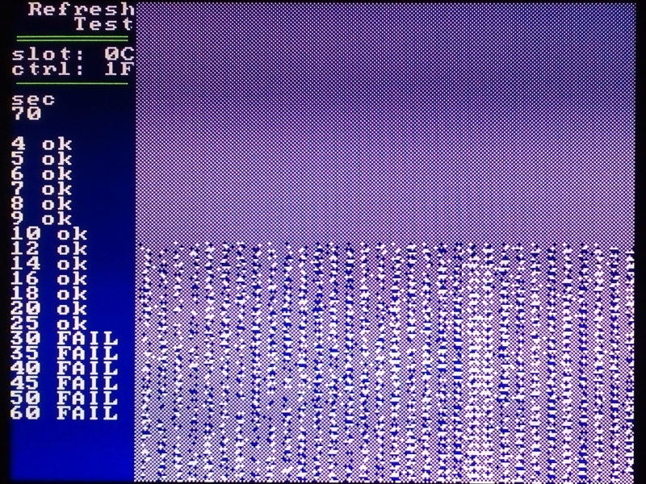
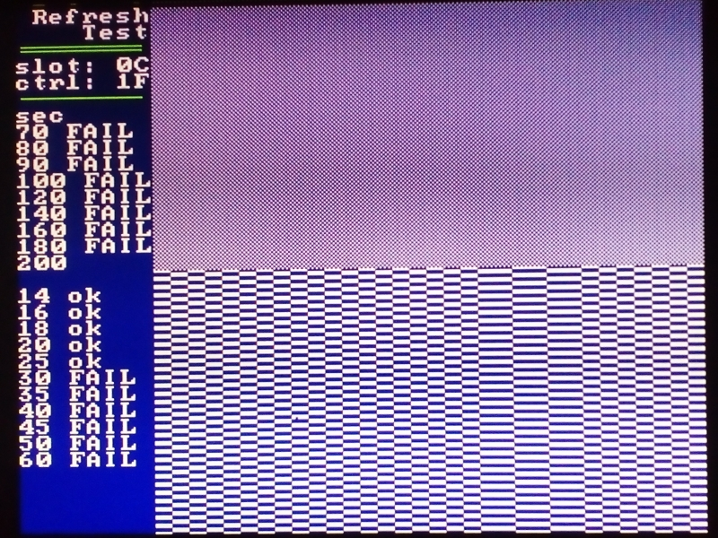
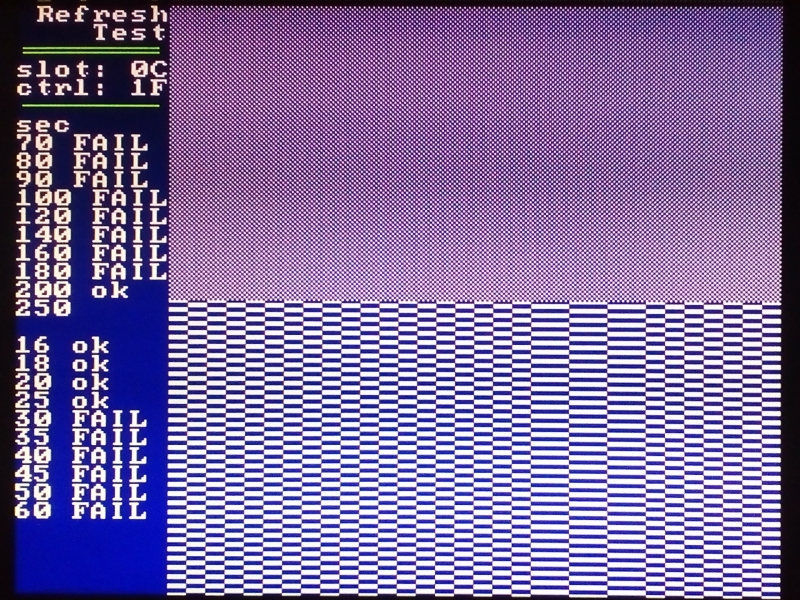

# Refreshtest

Mit dem Refreshtest lässt sich die Zeit ermitteln, bis ein dynamischer RAM-Speicher seinen Inhalt vergisst.
Genutzt wird das Speichermodul M036 im KC85/4, speziell mit dem Ersatzschaltkreis 16M2164 nach [^1].

Dort wird versehentlich ein Teil des Speichers nicht aufgefrischt, was sich dieser Test zu nutze macht.

## Parameter

Die Voreinstellungen sind:
Speichermodul M036 im Modulschacht '0C'
Speichersegment 7, Steuerwort '1F'

Ein anderer Modulschacht und ein anderes Modulsteuerwort können als Parameter mitgegeben werden.

## Programmablauf

Der zu testende RAM-Bereich liegt von 4000h bis 5FFFh
Der interne RAM4 wird für den Test ausgeschaltet.

Der Speicherbereich wird mit einem Muster gefüllt und über dieses Muster wird eine einfache Prüfsumme gebildet (SUM16).
Die Prüfsumme dient als Referenz für den weiteren Programmlauf.
Anschließend wird Speicherinhalt zur Sichtkontrolle wird in den Bildspeicher kopiert.

Als Nächstes wird eine bestimmte Zeit gewartet, beginnend mit 20 ms.
Der Speicher wird wieder zur Anzeige gebracht und es wird die Prüfsumme gebildet.
Wenn die Prüfsumme stimmt, erfolgt die Ausschrift 'ok', es wird die Wartezeit erhöht und das Warten beginnt erneut.

Andernfalls erfolgt die Ausschrift 'FAIL'.
Nach Ablauf der längsten Wartezeit (1000 s) oder einem Tastendruck wird das Programm beendet.

## Beispiel

Im dargestellten Beispiel betrug die Raumtemperatur ca. 21° C.
Nach 18 Sekunden sind alle Speicherstellen noch richtig:

Nach ca. 30 Sekunden kippt die erste Speicherstelle:

Nach ca. 60 Sekunden ohne Refresh lässt sich ein Muster erahnen:

Die letzt Speicherstelle, die noch nicht gekippt ist, erkennt man nach ca. 180 Sekunden.

Nach ca. 200 Sekunden ohne Refresh sind alle Speicherstellen komplett im Ausgangszustand:lässt sich ein Muster erahnen:

### Referenzen und Links

[^1]: Schaltkreisersatzplatine 16M2164 [https://www.sax.de/~zander/ --> Hobby --> KC85 --> Hardware --> 128K-Segmented-RAM-Modul (M036)](https://www.sax.de/~zander/)
